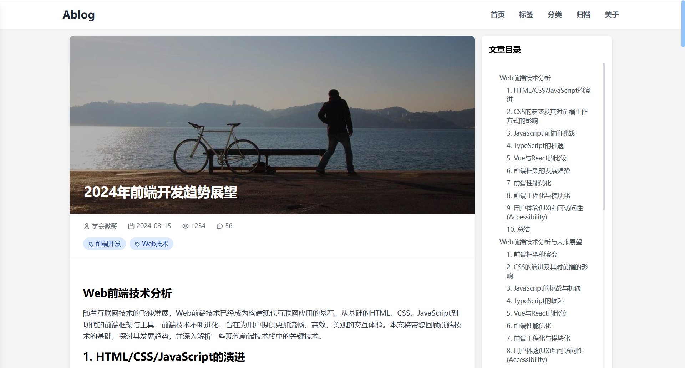
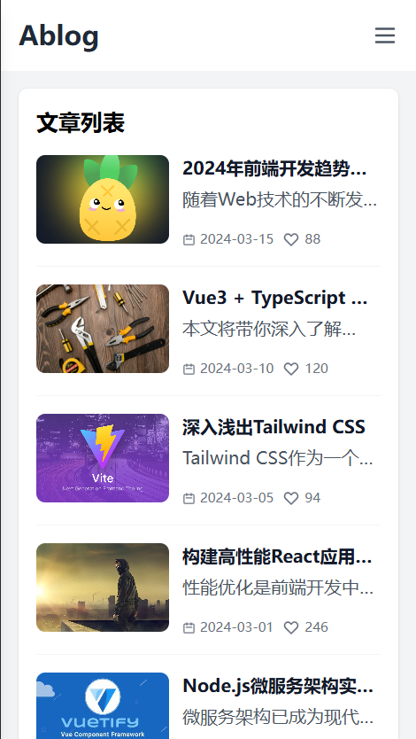
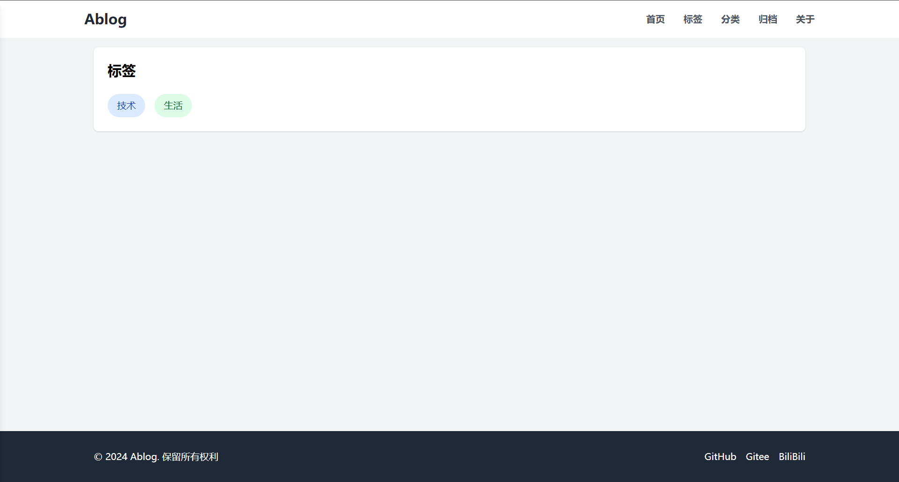
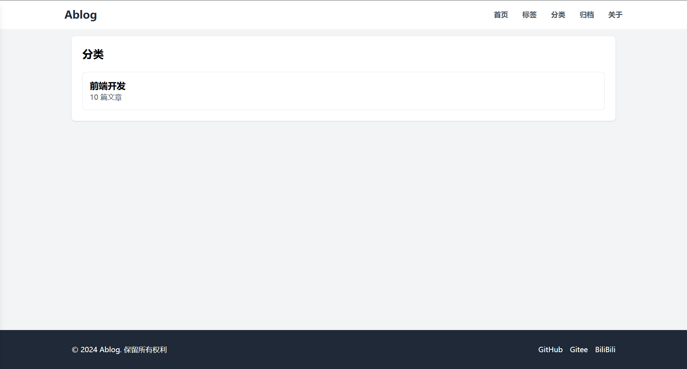
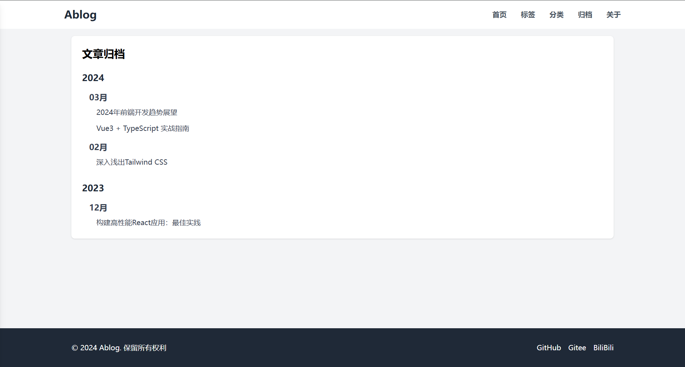
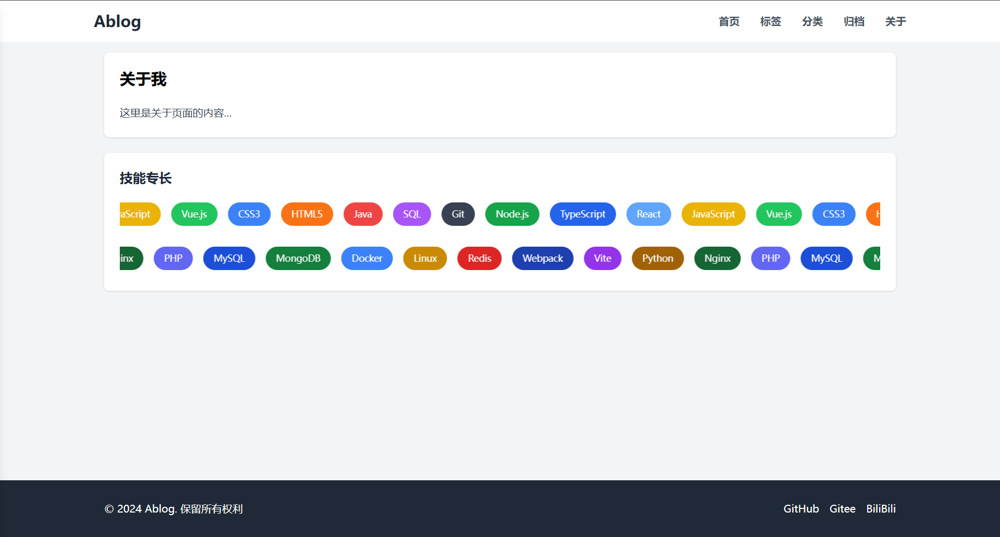

# vue3 + vite + tailwindcss个人博客项目前台模板
## 1. pnpm 命名
### 安装依赖
```
pnpm install
```
### 项目运行
```
pnpm dev
```
### 项目打包
```
pnpm build
```
## 2. 项目特色
- 基于Vue3 + Vite + Tailwindcss
- 响应式布局
- 实现头部导航栏根据屏幕的滚动显示和隐藏
- 实现文章列表分页
- 实现一键回到顶部
- 实现文章目录获取和跳转到指定位置
- 整体布局简洁大方，适合个人博客使用
- 布局参考网站：[https://maria.oceanwp.org/home/)

## 3. 效果图展示
1. 首页

2. 文章详情页

3. 移动端适配
帮我把图片剧中一下

4. 移动端侧边栏

5. 标签

6. 分类

7. 归档

8. 关于

